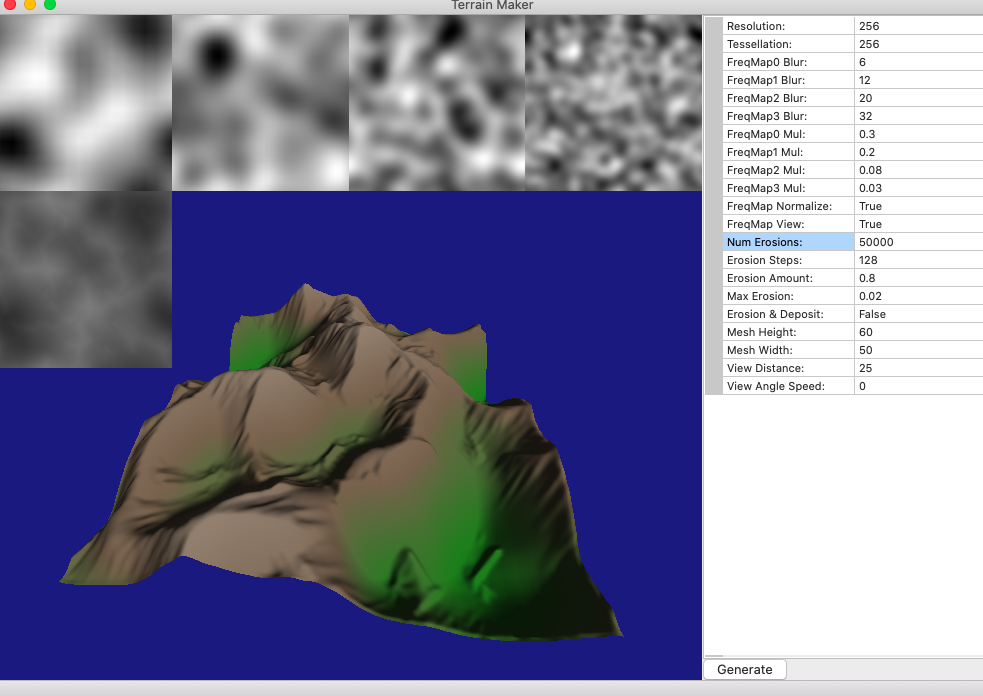

# Terrain Maker:
Terrain Maker is a terrain generator that simulates erosion.

# Third party libraries:

* glm:
    * link: https://github.com/g-truc/glm
    * license(MIT): https://github.com/g-truc/glm/blob/master/copying.txt
    
            copy glm to third_party/includes/

* wxWidgets:
    * link: https://www.wxwidgets.org/
    * license: https://www.wxwidgets.org/about/licence/

            copy wx binary libraries to third_party/libs/wx/
            copy wx includes to third_party/includes/wx/

* std_image:
    * link: https://github.com/nothings/stb
    * license(MIT): https://github.com/nothings/stb/blob/master/LICENSE

            copy std_image_write.h and std_image.h to third_party/includes/std_image/

# Build:

release:

    sh build.sh

debug:

    sh build_debug.sh

# Screen Shots:

